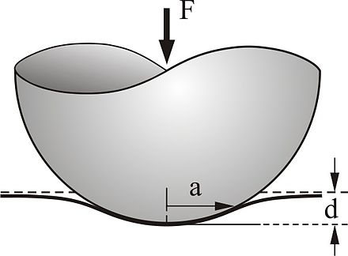
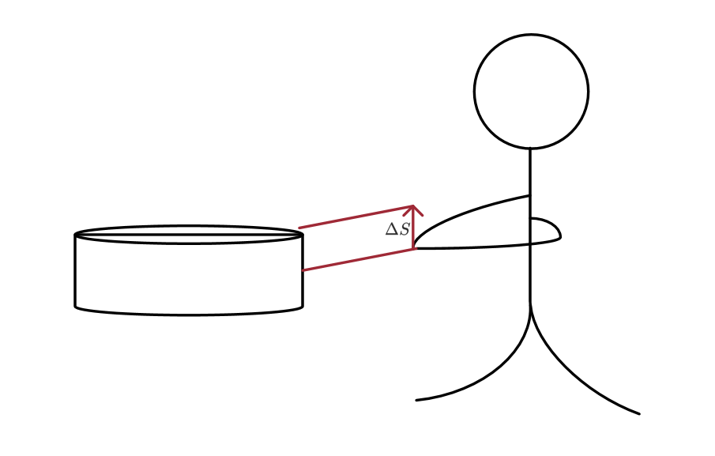
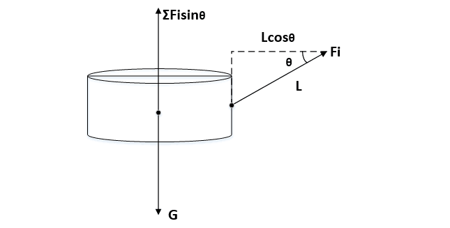
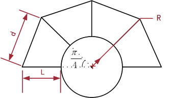
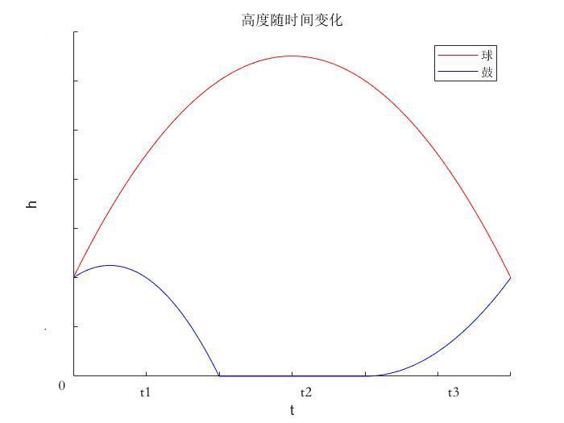
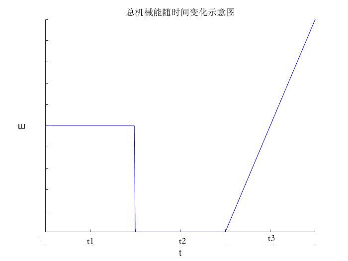
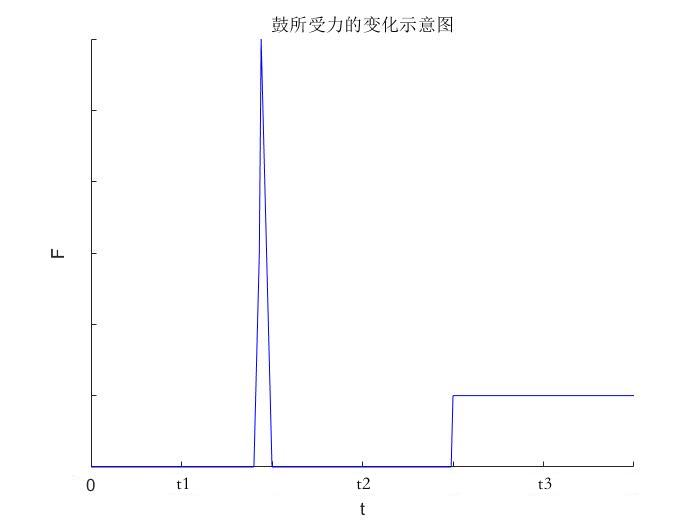
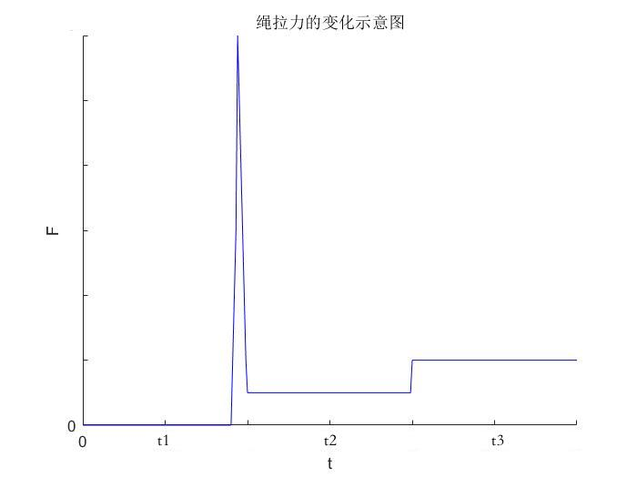

## 协作策略的最佳化

在人的控制力前提下，经过综合考量，我们以下面几点为目标设计最佳击鼓策略：

1. 规则简单，呈现周期性。简单的规则降低不确定性，且容易被参与者掌握。
2. 鼓（人）做总功小。总功小， 则人可以进行更久的游戏，进而得更高的分数。
3. 人用力尽可能小。可以减少人的疲劳疲劳感。

## 最优颠球模型

### 问题核心：运动各阶段的最优分析

在问题的开始，我们从实际出发，分析已有的较成功的颠球案例，发现它们的控球过程主要分为四个阶段。鼓与球的位移特征曲线大致如下。我们对此四个阶段进行进一步分析。

#### 接触阶段

##### 接触力学分析

接触阶段即鼓与球发生相互作用的阶段，通常这个阶段持续时间较短，并产生大量的能量交换。考虑球与鼓的弹性，在实际情况下，可能会有相对较长的接触过程。此外，我们需要测算鼓与球能量交换过程中的能量损失，用以确定鼓的最佳速度。

在球与鼓短暂接触的阶段的问题主要属于接触力学范畴。由于鼓面相对较大 ，且质量相对较大，排球形状较规则，且两者无粘着作用，因而可以将该问题近似视为弹性球体和弹性半空间体的接触。

借助赫兹接触理论，可以对该问题进行求解。

赫兹接触理论中，

【书上的方程与其解释，都放上。(5.18), (5.19), (5.20), (5.21), (5.22), (5.23), (5,26)】

则作用力$F''$为 
$$
F'={{\frac {4}{3}}E^{*}R^{1/2}d^{3/2}}
$$
得知接触深度后，我们可以计算该作用力。并借此，我们可以估计碰撞持续时间，并进一步计算碰撞过程移动距离。

$$
a_{hit} \leq F' / m \\
t_{hit} \approx(v_{up}-v_{down}) / a_{hit}
$$

在本题中，我们根据后续的粗略观测，设定在本实验条件下，$d \le 0.5cm$。实际中，它可以被准确衡量。并且在实验中得到$t_{hit} \approx 15ms $，移动距离 $x \le 1cm$，即相对于完整碰撞周期，碰撞过程的细节可以忽略\footnote{在本章实验部分，对该实验部分进行了具体讨论}。基于此，之后的分析中，我们将弹性碰撞视为简单碰撞。

##### 能量分析

我们从宏观角度重新分析该碰撞过程。如前所述，我们希望动力学过程保证周期性，因而要求排球的撞击前与撞击后速度相同，均为$v'$。

碰撞过程中我们忽略重力作用，可以列出以下动量守恒方程。

$$
m_{d} v_{d1} - m_b v{'} = m_b v{'} + m_d v_{d2}
$$

由于碰撞将产生较大的能量损失，我们列出一下修正的能量守恒方程。

$$
\frac12 m_b{v'}^2 + \frac12 m_dv_{d1}^2 =\frac12 m_b{v'}^2 + \frac12 m_dv_{d2}^2 + \Delta E_{hit} \\
$$

碰撞的能量损失可以由回复系数衡量，它的公式为：

$$
e = \frac{|v_{d2} - v'|}{|v_{d1} + v'|} = \frac{ |v'| - |v_{d2}|}{|v_{d1}| + |v'|}
$$
我们可以设计实验对恢复系数进行测量，进行回归分析。在本题研究范围内，我们将粗略的认为碰撞系数是常数。

### 球鼓分离运动阶段

球鼓分离运动阶段，我们让鼓保持自由落体运动。自由落体运动阶段，重力势能所产生动量，在转换至静止态时产生一个冲量抵消。该阶段的运动时间$t_1$满足一下方程，其中$\Delta h_d$为最低点与撞击点的距离。

$$
v_{d2}t_1 - \frac12 g t_1^2 = \Delta h_d
$$

### 鼓静止于最低点

为描述静止状态，我们需要了解最低点距离与鼓球的碰撞点\footnote{在接触阶段的分析中，我们说明了对碰撞过程所做简化的合理性。}的距离$\Delta h$。拉动过程中，由于可以稳定的控制拉力方向，我们认为绳线与鼓面的夹角不变。手垂直向上拉动，抬升距离以半臂长度$\Delta s = 0.10m$估算。则鼓的加速距离$h_{d} \approx \Delta s = 0.10m$.

为从碰撞点进入静止点，鼓需要在减速过程中获得的冲量可由以下公式描述，如何给是等效的。我们假设冲量到达最低点的极短时间（可认为是一瞬间）被给出。设该阶段的总时间为$t_2$，我们可以近似认为它规定了人的有效反应时间。
$$
I = m_d v_{lowest} \\
\frac12 m_d v_{lowest}^2 = \frac12 m_dv_{d2}^2 + mg\Delta h_d\\
t_2 \ge 0
$$

### 鼓再加速

在加速阶段中，鼓除重力外受恒定合力$F$，经过指定的加速距离$\Delta h_d$，使其在碰撞点达到指定速度$v_{d1}$。该距离需要的加速时间为$t_3$，加速度为$a_d$。

$$
(F - m_dg)· \Delta h_d = \frac12 m_d v_{d1}^2\\
a_d t_3 = v_{d1}\\
a_d = \frac{F -m_dg}{m_d}
$$

此外，我们还有一个总体上的时间约束，如下。并且，在问题一中我们可以忽略人的反应时间，对静止过程不加约束。

$$
t_1 + t_3 \le t_1 + t_2 + t_3 =  T \\
T = 2·\sqrt{2gh}
$$

### 四个阶段综合分析

由此，我们可以绘制出鼓与球的竖直方向位移随时间变化图。

【图h-t】

【图v-t】

我们发现，这种策略在整体做功小的同时，为队员保留了较长的反应时间；使用球与鼓对冲的策略，既减少了球与鼓的接触时间、减少了失误率，也因更少的给予鼓能量而提高了能量转换效率。所以我们认为这种颠球策略是合适的。

## 最优控制模型

建立颠球模型后，我们进一步研究控制模型。对于整体策略中，该部分模型不影响系统所做功。但由于施力者是人，人在发力时有必要的生物能消耗。维持更高的力，会使施力者耐力下降更快。因而我们从静力角度进行分析。

控制模型由$n$根绳与鼓构成。由于力的方向、大小、时机均可控，我们假定每根绳均以相同方式用力。

我们假定某一时刻，所有人需对鼓提供合力$F$，每根绳需对鼓提供拉力$F_i$，两者关系为以下。

$$
|F| = \sum {|F_i| \sin(\theta)} = n · |F_i| \sin(\theta)
$$

则

$$
|F_i| = \frac{|F|}{n·\sin(\theta)}
$$

在$ 0 \le \theta \le \frac{\pi}{2} $时，$|F_i|$是递增的，因而我们希望球与鼓的距离尽可能的近。不过我们需要满足题目中的约束与关于人的身高的隐性约束。我们设人的最低身高为$H_{people}$，人与鼓沿最近的距离为$s $.我们要求的满足约束的最大的$\theta$.

$$
L · \cos(\theta) \geq s\\
L · \sin(\theta) \leq H_{people}
$$

## 参数估计、模型求解

为对模型的效果进行检验，我们设计实验估计、确定关键参数，并给出我们的最终策略。

### 实验测定

实验中，我们主要关注鼓与球的接触时间以及回复系数。我们将鼓静止放在地面，使用卷尺指示竖直高度，使球分别从$40cm$，$60cm$，$80cm$高度多次垂直下落\footnote{实验物品图片见附录。}。由于接触过程十分迅速，我们借助华为960帧慢镜头摄像机对下降动作进行拍摄，记录了球鼓接触时间、以及经过鼓上侧$10cm$的时间（下行与上行）。时间以计数各动作所保持的帧数的方式衡量，最终转化为秒为单位。以下为各指标的平均值。

| 自由落体高度      | 40cm  | 60cm  | 80cm  |
| ----------------- | ----- | ----- | ----- |
| $fn_{hit}$        | 16    | 14    | 15    |
| $t_{hit}（ms）$   | 16.7 | 14.6 | 15.6 |
| $fn_{down }$      | 32.5  | 25    | 22.5  |
| $fn_{up}$         | 37    | 30    | 28.5  |
| $t_{down}（s）$   | 0.034 | 0.026 | 0.023 |
| $t_{up}（s）$     | 0.039 | 0.031 | 0.030 |
| $v_{up}（m/s） $  | 2.95  | 3.84  | 4.27  |
| $v_{down}（m/s）$ | 2.59  | 3.2   | 3.37  |
| $\Delta E（J）$   | 0.27  | 0.61  | 0.93  |
| $coe_{re}$        | 0.878 | 0.833 | 0.79  |

由于我们做功最小，我们设下落距离为$0.4m$. 可得碰撞结束后球的上升速度。
$$
\min{v_{up}} = \sqrt{2gh}
$$
由于不计空气阻力，则球在下落、撞击前，它的速度也为$\min v_{up} = 2.80 m/s $.

最小运动周期为

$$
T_{min}= \frac {2 · \min v_{up}}{g} \approx 0.576 s
$$

可以发现，撞击过程持续时间极短，且几乎保持不变。并且相对最小运动周期不到$3\%$.我们认为可以将接触阶段持续时间忽略。接触过程中移动距离的估计值$\Delta x \le \frac{t_{hit}·\min v_{up}}{2}\approx 2cm$。实际上我们进行了较大的放缩。因而我们可以近似认为碰撞过程不会影响球相对于鼓的上升距离。进一步，我们将最低的目标高度调高至$h = 45cm$，以彻底避免可能出现的问题。此时$v_{min} = 2.97m/s$，$ T_{min} = 0.606s $。我们取恢复系数为$0.834$。

### 模型求解

首先我们对一些关键参数进行设置。排球与硬化的牛皮，它们的弹性模量与泊松比我们估算为1e6Pa与0.4。人与鼓沿的最短距离$s_{min}$可以通过以下方程计算。与其他长度参数的几何关系见下图。其中$n$为人数。

$$
s_{min} = \frac{d_{min}}{\sin(\frac{\pi}{n})} - R_d
$$

可以求得，$s_{min} = 0.583m$，此时发力角度$\theta = 69.91^\circ$，$E^* \approx  5.95e^5$。发力阶段，人的所用恒力为$|F_p| = 5.323N$，接触过程中，最大的作用力约为，$F_{max}\approx125.50N$。

碰撞前鼓速度$v_{d1} = 0.512 m/s$，$v_{d2} = 0.066m/s$，颠球周期$T = 0.606s$ ，鼓的自由下落时间$t_1 = 0.150s$，鼓静止时间$t_2 = 0.065s$，鼓的匀加速运动时间$t_3 = 0.391s$ ，鼓匀加速阶段所受的向上外力（加上重力）为$|F| = 39.99N$。

可以画出该情况下，球、鼓位移、力与时间的关系，如下图。

【以下四张图，2*2。】

虽然可以发现，用力很小，但是我们计算此时鼓底与手的距离，发现$\Delta H \approx 1.70m$，这是不切实际的。我们又额外计算了两种情况，$\Delta H = 0.5m$时，人在加速阶段提供的力量为$F_p = 21.80N$， 在$\Delta  H = 0.22m$时，力量为$F_p = 77.26N$（比较符合第二问的条件）。

此外，我们考虑寻找静止时间等于人的平均反应时间（$0.2s$）的掷球高度。我们发现高度为$0.625m$时，参与者有足够的反应时间。

综上，我们的策略是，发力阶段，每个人以$21.80N$的力，沿与水平方向$13.26^\circ$的角度向上提绳，发力时长$0.391s$，撞击后手不发力，保持$0.150s$，之后给球一个冲量使其保持静止。再等待$0.065s$后，开始下一个周期。

由于开始下落的高度时$0.4m$，我们不针对它做额外的修正。经过3个周期左右，球的高度将自然接近$0.45m$。

