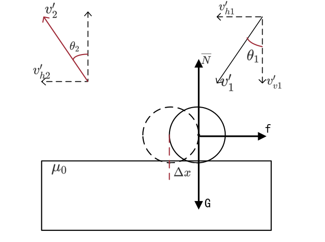
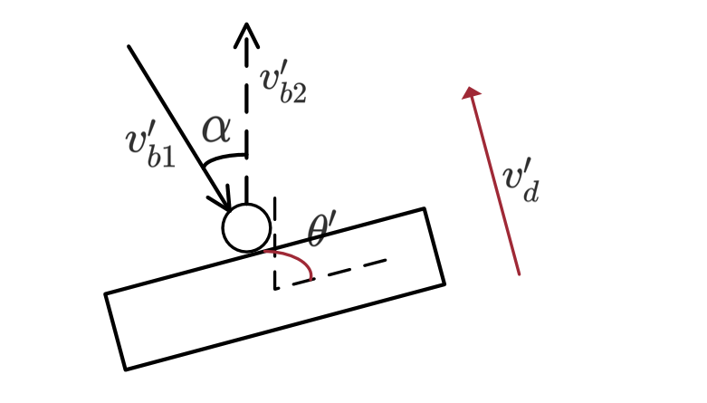
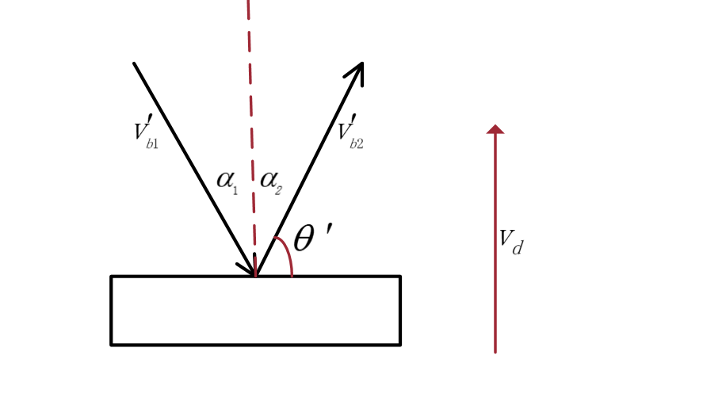

## 倾斜下落的修正

本问题中，我们需要对斜向球角度进行修正，因而我们需要首先对倾斜碰撞的动力学特征进行分析。

### 倾斜碰撞模型

我们在首先在二维竖直平面考虑该过程。碰撞过程中，球相对于鼓面有法向的冲击与切向的位移。法向上速度的改变遵循问题一颠球模型中能量损失的规律；切向上速度受到滚动摩擦的限制。

根据以上图示，可以列出下列公式。
$$
v'_{b1} = v_b'·\cos(\theta)\\
e = \frac{v_{bv2}}{v_{bv1}}\\
v'_{bh1} = v_b' · \sin(\theta)
$$

根据水平方向的机械能守恒，列出一下公式。其中$\Delta x'$为球鼓滚动过程平移的距离，$f$为滚动摩擦。

$$
\frac12 m_d {v'}^2_{bh2} = \frac12m_d{v'}^2_{bh1} - f·\Delta x'\\
$$

滚动摩擦的效应使用一下公式近似估算，其中$\bar{N}$为平均压力，$\mu'$为滚动摩擦系数。

$$
f = \mu' \bar{N}
$$

平均的压力通过以下公式估算。其中，$\bar{F}$为接触阶段的平均压力。
$$
\bar{N} \approx \bar{F} + G \cos(\theta) = \frac{m_d'v _{dh1} - m_d'v_{dh2} }{\Delta t} + m_d g  \cos(\theta)
$$

滚动距离估算公式如下，后续模型求解过程中我们使用不等式右端的下界估算$\Delta x'$.

$$
\Delta x' \le v'_{bh1} · \Delta t
$$

### 二维倾斜修正模型

对于本问题，碰撞示意图如下。

我们希望找到在撞击时，鼓与铅直方向的角度$\theta'$，使得此时的$v_{b2}'$方向竖直向上。由于撞击时间很短（$\Delta t \approx 0.015s$），其间产生的压力很大（$\bar{F} \approx 100N$），我们决定忽略重力产生的作用。于是，可以将坐标系进行转换，各变量的变换关系如图所示。

我们希望在碰撞后，上升的高度尽量满足$60cm$。我们考虑此时鼓应满足的上升速度$v_{d}'$。由于鼓与水平面倾斜角度极小，所以我们使用问题一中颠球模型近似求解，即参数$h = 0.6m$，通过计算$v_{b2}'$，可求得$v_d'$。

$$
v_{b2}' \approx \sqrt{2gh}
$$

因而现在我们只需在以下约束下求解$\theta$。 其中$\alpha_1$是入射角，$\alpha_2$是出射角。
$$
\alpha_1 + \alpha_2 = \alpha = 1^{\circ}\\
$$

### 模型求解

#### 倾斜角度计算

我们以$0.001^\circ$为步长，寻找最优的入射角度。最终我们找到，当入射角度为$0.505^\circ$时，出射角度为$0.496^\circ$度，可以认为合角度为$1^\circ$。此时鼓与平面的夹角为$0.496^\circ$。

v我们假设鼓与地面平行。我们发现，如果鼓不为球提供动力，球的出射角度将越来越低，因为相对摩擦而言，法向的能量损失更大。如果给鼓提供相同的力，使它的入射速度与出射速度保持不变，倾斜角度将减少，倾斜度会因为摩擦自动被修正，不过速度很慢。

【上面两个图左右放，放一排】

#### 合作策略制定

根据本题的条件，人数为十人，且球的出射方向在两人见三分之一的方向。我们预期使鼓的法向量与球出射轨迹保持共面，我们以此为目标设计策略。

根据对该问题的分析和对前面问题的的讨论，我们列出以下公式。

$$
10 F_0 \sin\theta = mg\\
\sin\theta = \frac{H}{L}\\
\frac{F_1}{\sin{24^\circ}} = \frac{F_2}{\sin{12^\circ}}\\
\frac{F_6}{\sin{24^\circ}} = \frac{F_7}{\sin{12^\circ}}\\
F_{all} · r · \cos{\beta} = I_{yy} · \frac{w_\beta}{dt}\\
\sum F_i \sin\theta - mg = ma\\
a_1t + a_2t = v\\
\frac12 a_1 t^2 + a_1t^2 + \frac12 a_2 t^2 = s\\
\beta = 0.49573
$$

【丰恒的图】

最终我们经验的得到一组用力方案：初始时，每个人依次的用力为110N，80N，70.6N，70.6N，70.6N，70.6N，51.5N，72.5N，70.6N，70.6N]；在0.1s后，每个人的用力方案改换为94.4N，94.4N，94.4N，94.4N，94.4N，60N，80N，94.4N，94.4N，94.4N。在0.2s后的，鼓的角度与水平面的角度为49.95度。

可以发现，当可以准确发力时，该这个合作策略可以较好地对球的倾斜度进行修正。

### 合作策略评估

该合作策略利用了对称性，并使策略尽可能简单，仅涉及必要的四个人，在某种程度降低了可能的失误。我们进而分析实际情况中，人的失误对该策略可能造成的影响。

以鼓为参考系下，我们已知入射角度$\alpha_{1}$。我们利用通过第三问的模拟，假设该策略中的每个力的大小与方向为正态分布，使用蒙特拉罗算法估计出射角度$\alpha_{2}$的分布。

【示意图】

【可以发现。。。。可以做一些什么调整。。。】

最终的策略

